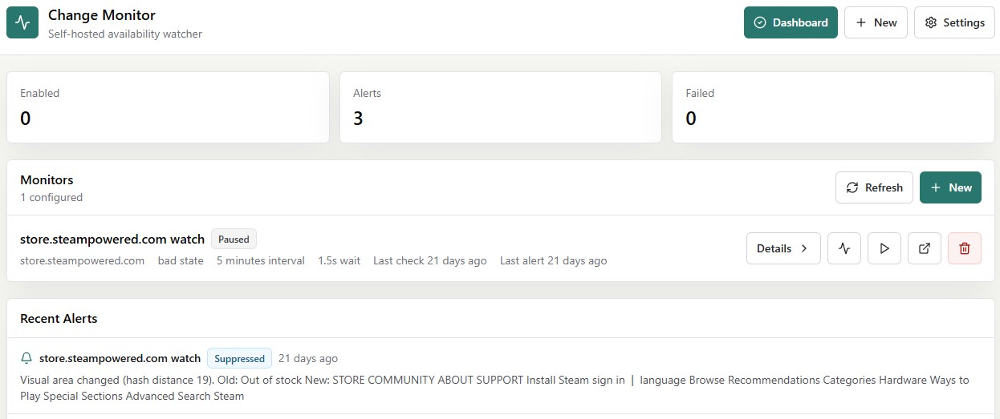
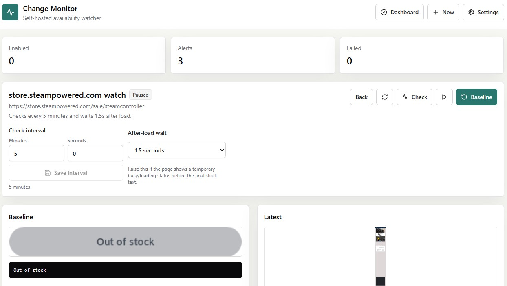

# Change Monitor

A self-hosted web app for monitoring rendered web pages and sending Pushover alerts when meaningful changes appear. The app is aimed at retail/restock monitoring where the current state is known to be bad, such as "Out of Stock", but the future good state is unknown.

## Screenshots






## What Is Implemented

- FastAPI backend with SQLite persistence.
- React, TypeScript, Vite, and Tailwind frontend.
- Playwright Chromium page rendering.
- Screenshot preview with clickable element overlays.
- Whole-page text, selected-element text, selected-element visual, and bad-state monitors.
- Baseline snapshots with stored text, HTML snippets, screenshots, and perceptual hashes.
- Rule evaluation for bad text disappearance, positive phrase appearance, text changes, selector loss, and visual hash changes.
- Manual check-now, pause/resume, delete, and rebaseline actions.
- Scheduler with jitter, low concurrency, per-domain locking, and failure backoff.
- Pushover profiles with encrypted local token storage.
- Volume-backed app settings with an integrity hash and a generated encryption key.
- Docker image build checks that verify the backend, database, encryption, health endpoint, and Playwright browser launch.

## Docker

The production image is designed to run without a `.env` file. Runtime settings are configured from the app's Settings screen and saved in the `/data` volume.

```powershell
docker run -d `
  --name change-monitor `
  --restart unless-stopped `
  -p 8085:8000 `
  -v change-monitor-data:/data `
  max1234565/changemonitor:latest
```

Open `http://localhost:8085`, then go to Settings to configure the public URL, default monitor timing, scheduler concurrency, and Pushover profiles.

The optional compose file is only a deployment shortcut:

```powershell
docker compose up -d
```

For a bind mount on a server, make sure the directory is writable by UID `1000`:

```bash
sudo mkdir -p /opt/homelab/volumes/change-monitor/data
sudo chown -R 1000:1000 /opt/homelab/volumes/change-monitor/data
```

## Stored Settings And Secrets

The app stores its runtime settings in:

```text
/data/config/app-settings.json
```

That file contains non-secret values such as the public app URL, default check interval, default render wait, jitter, and max concurrent checks. It also includes a SHA-256 integrity hash so accidental edits can be detected and normalized on the next startup.

Secrets are encrypted with Fernet using:

```text
/data/config/encryption.key
```

The key is generated on first startup and kept in the data volume so encrypted Pushover credentials survive container rebuilds and restarts. If `CHANGE_MONITOR_SECRET_KEY` or the legacy `SECRET_KEY` is present on the very first upgraded startup, the app seeds `encryption.key` from that value so existing encrypted data can continue to decrypt after `.env` is removed. Once the key file exists, the volume is the source of truth.

Pushover user keys and app tokens are entered from the Settings screen and saved encrypted in SQLite. The Pushover test message is intentionally configured and triggered after install from the UI.

## Local Development

Backend:

```powershell
cd backend
python -m venv .venv
.\.venv\Scripts\Activate.ps1
python -m pip install -r requirements.txt
python -m playwright install chromium
$env:DATA_DIR = (Resolve-Path ..\data).Path
uvicorn app.main:app --reload --host 0.0.0.0 --port 8000
```

Frontend:

```powershell
cd frontend
npm install
npm run dev
```

Open `http://localhost:5173`. The Vite server proxies `/api` to `http://127.0.0.1:8000`.

The direct local backend run only needs `DATA_DIR` if you want data somewhere other than `backend/data`. The Docker image already sets `DATA_DIR=/data`.

## Install Checks

Backend tests:

```powershell
cd backend
python -m pytest tests
```

Strict install smoke check, including an actual Chromium launch:

```powershell
cd backend
$env:CHANGE_MONITOR_STRICT_INSTALL_CHECK = "1"
python -m pytest tests
```

The Dockerfile runs this strict check during image build. A Docker image will fail to build if Playwright cannot launch Chromium.

## Building And Publishing

Build locally:

```powershell
docker build -t max1234565/changemonitor:latest .
```

Push manually:

```powershell
docker login
docker push max1234565/changemonitor:latest
```

The repository includes GitHub Actions workflows:

- `.github/workflows/ci.yml` runs backend tests, a strict Playwright install smoke check, frontend build, and Docker image build on pushes and pull requests.
- `.github/workflows/docker-publish.yml` publishes multi-architecture images to Docker Hub from a GitHub release or manual workflow run.

To publish from GitHub, add these repository secrets:

```text
DOCKERHUB_USERNAME
DOCKERHUB_TOKEN
```

## Docker Image Notes

The runtime image installs Chromium with:

```text
python -m playwright install --with-deps chromium
```

That is important because a plain browser install can omit native libraries such as `libasound2`, which causes Playwright to fail at runtime with "Host system is missing dependencies to run browsers." The image also includes a Docker healthcheck at `/health`.

## Notes

- The app does not bypass CAPTCHAs, rotate proxies, automate purchasing, or perform checkout.
- Use conservative intervals. The default restock-oriented path uses 3 minutes with jitter.
- Screenshots can contain private page content. Keep the data volume protected and delete monitors you no longer need.
